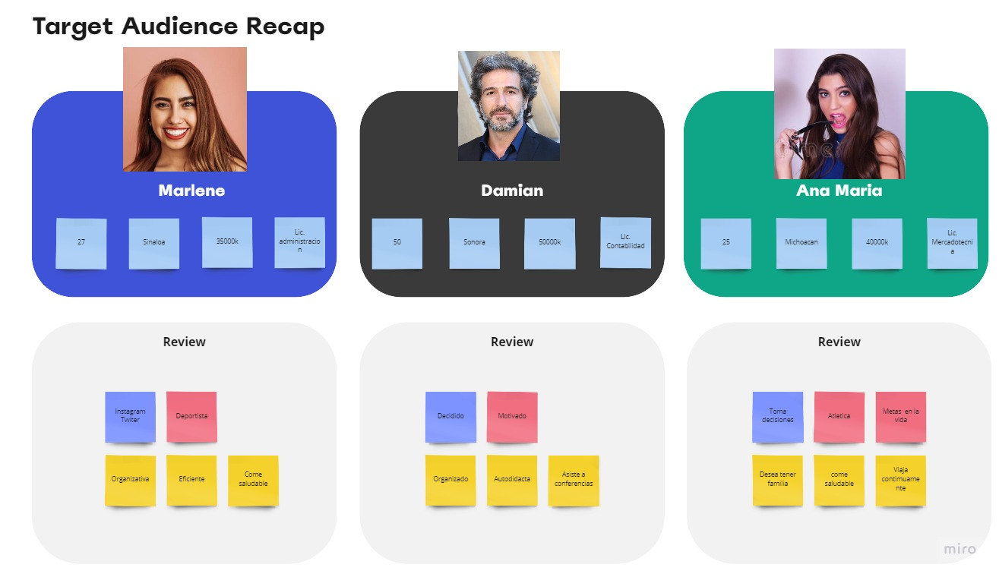

# Toma de requerimientos

Cliente:

* Crear una cuenta

* llenar un formulario

* introducir forma de pago

* recibir notificaciones del Proceso

Administrador:

* Crear la pagina apta para smarphone

* seguir los requerimientos del cliente para el diseño

* automatizar la pagina para que sea capaz de crear el documento legal al momento que el cliente llene el formulario

* agregar opciones de metodos de pago para el cliente

* agregar dashboard para ver cantidad de ingresos recibidos

* agregar notificaciones y comentarios del proceso

* notificar al cliente.

# Diagrama de flujo

## Administrador

## Cliente

# Buyer person

# Publico Objetivo

# Administrador

# Cliente

# UI Abogabot

